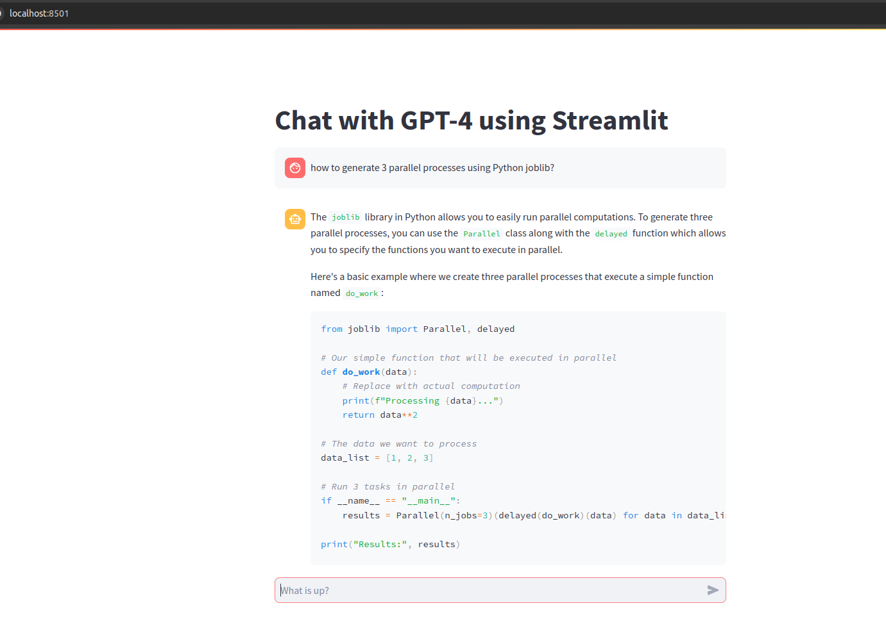
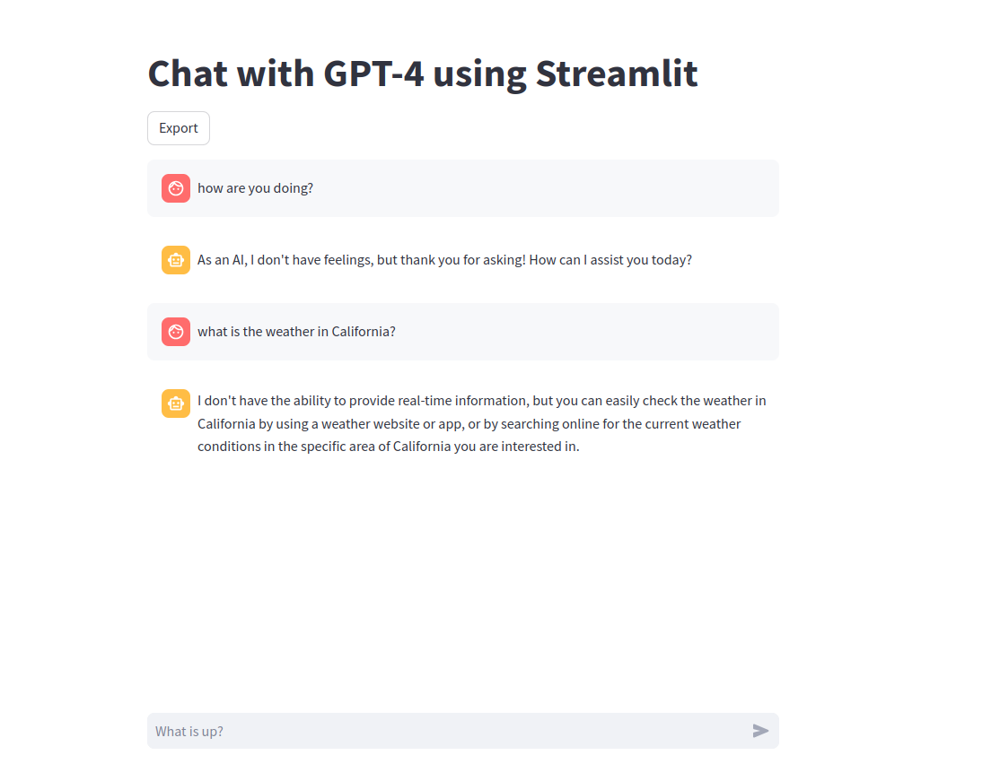
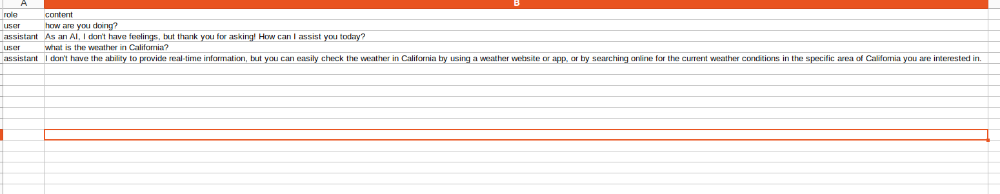
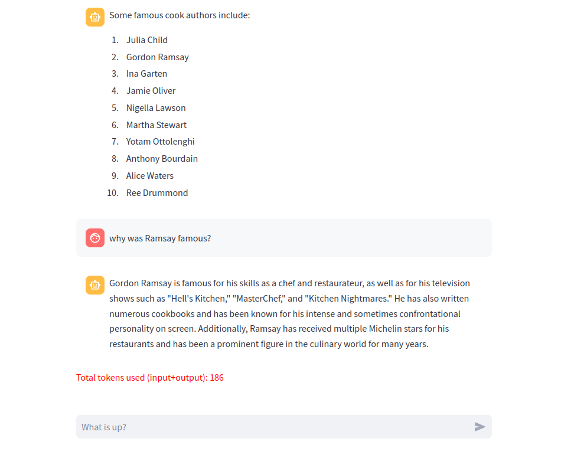

# chat-with-gpt4-streamlit
Chat with your GPT-4 model using OpenAI API via Streamlit web app using latest OAI and streamlit packages

# Main reference for Streamlit related code:
- https://docs.streamlit.io/knowledge-base/tutorials/build-conversational-apps

# [Blog article describing this app](https://tech-depth-and-breadth.medium.com/chat-with-gpt-4-using-streamlit-using-the-openai-api-b1d88920f0ff)

## Starting the app

1. Set up OpenAI API key as a streamlit secret
- Create `.streamlit/secrets.toml` file in the project/current directory and add the following lines to it:

`OPENAI_API_KEY = "YOUR_API_KEY"`
NOTE: You need to procure your API key from the OpenAI website by making the required payment. You could start small with $5.

2. Set up virtual environment using venv in Unix/macOS:
- `python -m venv .venv`
- `source .venv/bin/activate`
- `pip install -r requirements.txt`

3. Start the app by following below steps:

- Activate the virtual environment: `source .venv/bin/activate` (if not already activated)

- Then, use Makefile command: `make run` or directly start app using `streamlit run chat_with_gpt4_streamlit/main.py`
- Navigate to `http://localhost:8501` where streamlit runs by default
- Sample run of the app: 

4. More features of the chat app:

- Streaming generation of the response - No waiting!
- Export the current conversation to save on API calls - outputs are written in the project directory inside a folder called `exports`
    - A CSV file is created with the time stamp of the local time when the export button was clicked
    - Export button: 
    - Exported content as a CSV file: 
- Get total tokens used using the `tiktoken` library
    - See total tokens used in the current conversation: 

5. Advanced configurations:

- Adjust the name of the OpenAI text generation model used by changing the `OAI_MODEL` parameter in the `configs.py` file
List of all possible models from OpenAI [here](https://platform.openai.com/docs/models/gpt-4-and-gpt-4-turbo) and [here](https://platform.openai.com/docs/models/gpt-3-5)
- Adjust the location where the chat exports are saved by changing the `EXPORT_DIR` parameter in the `configs.py` file. This path is with respect to the project root directory.